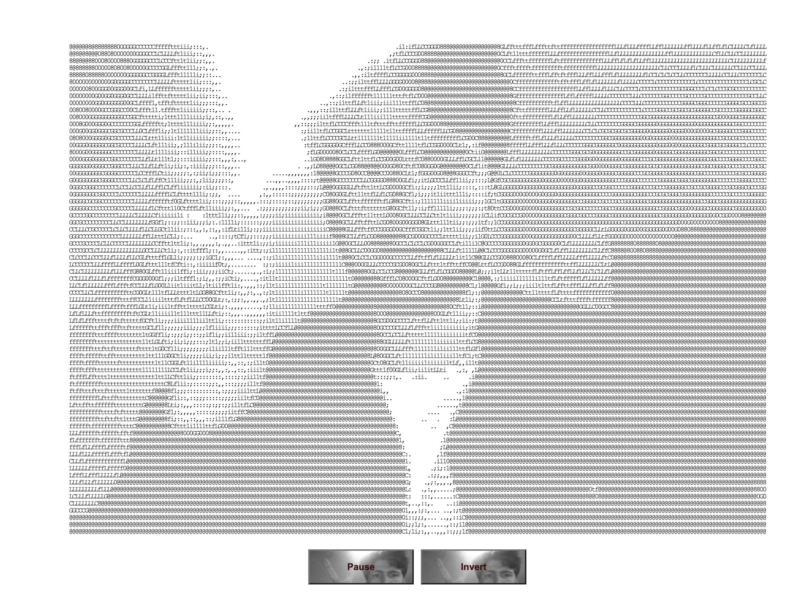
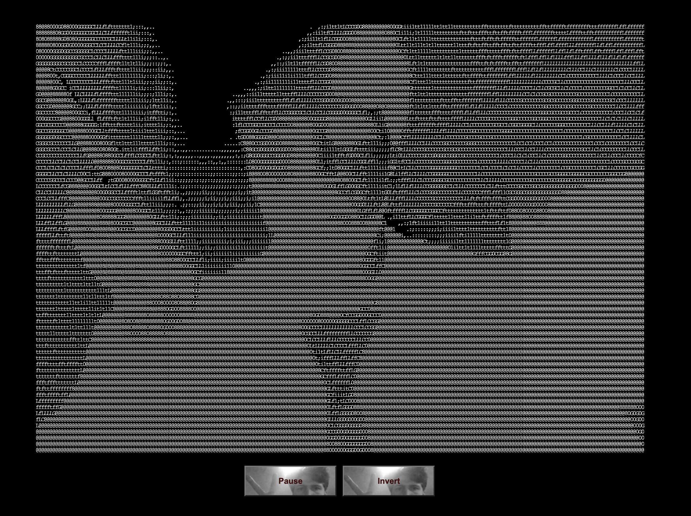

# AsciiVision: Interactive ASCII Art Generator
AsciiVision is a creative coding project that merges human-computer interaction with artistic expression. By transforming your webcam feed into ASCII art in real-time, AsciiVision offers an immersive experience that blurs the boundaries between technology and creativity.

  

  Ascii image in black and white.

## Features
- **Real-time ASCII Art:** AsciiVision captures video from your webcam and converts it into ASCII characters, providing a dynamic and interactive visual output.
- **Customizable Color Schemes:** Experiment with different color schemes such as black and white or vibrant green text on a black background to tailor the visual aesthetic to your liking.
- **Interactive Controls:** AsciiVision offers intuitive controls to start or pause the webcam feed and toggle between various color schemes, empowering users to actively engage with the artwork they create.
- **Inverted Colors:** Explore the impact of inverted colors on the ASCII art, altering its appearance and revealing new layers of visual complexity.

## How It Works
AsciiVision leverages the Camera API to access your device's webcam, enabling seamless integration between the physical world and digital art creation. Through JavaScript, each pixel's brightness is mapped to a corresponding ASCII character, offering a real-time interpretation of the captured video feed. This synthesis of human-computer interaction and creative coding results in an immersive and engaging user experience.

## Usage
To unleash your creativity with AsciiVision, simply open the webpage in a compatible browser and grant permission to access your webcam. Once the webcam feed is initiated, you can interact with the controls to adjust color schemes, invert colors, and pause/resume the ASCII art generation process. Experiment with different settings to discover unique visual compositions and share your creations with others.

## Functionalities
AsciiVision offers a range of interactive functionalities designed to enhance the user experience and encourage creative exploration:

- **Real-time ASCII Art Generation:** AsciiVision captures live video from your webcam and converts it into ASCII art in real-time, providing immediate visual feedback and enabling dynamic artistic expression.
- **Customizable Color Schemes:** Users can choose from a selection of predefined color schemes, including classic black and white or vivid green text on a black background. This customization feature allows individuals to tailor the visual style of the ASCII art to suit their preferences and artistic vision.
- **Interactive Color Inversion:** AsciiVision allows users to invert the colors of the ASCII art with a simple toggle, offering an alternative perspective on the artwork and unlocking new creative possibilities.
- **User-Friendly Controls:** AsciiVision features intuitive controls that enable users to start or pause the webcam feed and adjust color settings with ease. These user-friendly interactions promote a seamless creative workflow and empower individuals to engage actively with the artistic process.
- **Cross-Device Compatibility:** AsciiVision is designed to be compatible with a wide range of devices and browsers, ensuring accessibility and usability across different platforms. Whether you're using a desktop computer, laptop, or mobile device, AsciiVision provides a consistent and immersive experience for all users.

These functionalities combine to create an interactive and engaging artistic tool that encourages experimentation, exploration, and self-expression. Whether you're a seasoned creative coder or a curious newcomer, AsciiVision invites you to discover the fascinating intersection of technology and art.

## Credits
AsciiVision is the brainchild of Jonas Kjeldmand Jensen, conceived as a fusion of creative coding, human-computer interaction, and interaction design principles. The project utilizes the `camera.js` library by Andrei Gheorghe for webcam access and video processing.

## License
AsciiVision is licensed under the MIT License.

## Get Involved
Join the creative coding community and contribute to AsciiVision by forking the repository on [GitHub](https://github.com/QC20/AsciiVision). Whether you're interested in enhancing functionality, refining user interface elements, or exploring new artistic possibilities, your contributions are welcomed and appreciated.

  

  Ascii image in white and black.

**To do:** 
- [ ] fix toggle clicking on (without doing anything) when in normal mode
- [ ] Fix being able to switch between invert and normal when paused
- [ ] see through mirror bottons
- [ ] Make something cool with the name at the button
- [ ] refractor code
- [ ] write new comments everywhere to document logic

